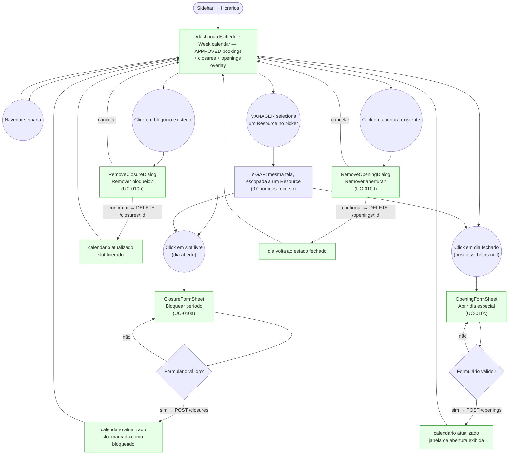

# STAFF — Horários (Schedule & Closure Management)

**Actor(s):** STAFF | MANAGER  
**Goal:** View the calendar of approved bookings and manage schedule closures and openings  
**UCs covered:** UC-010a, UC-010b, UC-010c, UC-010d (✅ Done) · UC-010e, UC-010f (❓ Gap — M21 Cluster 1, resource-scoped extension, MANAGER-only) · UC-057 (❓ Gap — M21 Cluster 2, manager multi-resource day grid)  
**Status:** Done (base) — resource-scoped extension not yet built, see the ❓ GAP section in `dev-notes.md`

## Flow

```mermaid
flowchart TD
    classDef existing fill:#e6ffe6,stroke:#3a3
    classDef gap stroke:#f00,stroke-dasharray: 5 5,fill:#fee

    Start(["Sidebar → Horários"]) --> Schedule["/dashboard/schedule<br/>Week calendar — APPROVED bookings<br/>+ closures + openings overlay"]

    Schedule --> WeekNav(("Navegar semana"))
    WeekNav --> Schedule

    Schedule --> ClickSlot(("Click em slot livre<br/>(dia aberto)"))
    ClickSlot --> ClosureSheet["ClosureFormSheet<br/>Bloquear período<br/>(UC-010a)"]
    ClosureSheet --> ClosureForm{"Formulário válido?"}
    ClosureForm -- não --> ClosureSheet
    ClosureForm -- sim → POST /closures --> ClosureSuccess["calendário atualizado<br/>slot marcado como bloqueado"]
    ClosureSuccess --> Schedule

    Schedule --> ClickClosure(("Click em bloqueio existente"))
    ClickClosure --> RemoveClosureSheet["RemoveClosureDialog<br/>Remover bloqueio?<br/>(UC-010b)"]
    RemoveClosureSheet -- cancelar --> Schedule
    RemoveClosureSheet -- confirmar → DELETE /closures/:id --> RemoveClosureSuccess["calendário atualizado<br/>slot liberado"]
    RemoveClosureSuccess --> Schedule

    Schedule --> ClickClosedDay(("Click em dia fechado<br/>(business_hours null)"))
    ClickClosedDay --> OpeningSheet["OpeningFormSheet<br/>Abrir dia especial<br/>(UC-010c)"]
    OpeningSheet --> OpeningForm{"Formulário válido?"}
    OpeningForm -- não --> OpeningSheet
    OpeningForm -- sim → POST /openings --> OpeningSuccess["calendário atualizado<br/>janela de abertura exibida"]
    OpeningSuccess --> Schedule

    Schedule --> ClickOpening(("Click em abertura existente"))
    ClickOpening --> RemoveOpeningSheet["RemoveOpeningDialog<br/>Remover abertura?<br/>(UC-010d)"]
    RemoveOpeningSheet -- cancelar --> Schedule
    RemoveOpeningSheet -- confirmar → DELETE /openings/:id --> RemoveOpeningSuccess["dia volta ao estado fechado"]
    RemoveOpeningSuccess --> Schedule

    class Schedule,ClosureSheet,ClosureSuccess,RemoveClosureSheet,RemoveClosureSuccess,OpeningSheet,OpeningSuccess,RemoveOpeningSheet,RemoveOpeningSuccess existing

    %% M21 Cluster 1 — resource-scoped extension (GAP, MANAGER-only)
    Schedule --> ResourcePick(("MANAGER seleciona<br/>um Resource no picker"))
    ResourcePick --> ScheduleScoped["❓ GAP: mesma tela, escopada a um Resource<br/>(07-horarios-recurso)"]
    ScheduleScoped --> ClickSlot
    ScheduleScoped --> ClickClosedDay
```

## Pages referenced

| Page / Route | Component | Story | Status |
|---|---|---|---|
| `/dashboard/schedule` | `SchedulePage` (week calendar grid) | M13-S21 | ✅ Done |
| Closure creation bottom sheet | `ClosureFormSheet` within `SchedulePage` | M13-S21 | ✅ Done |
| Closure removal confirmation | `RemoveClosureDialog` within `SchedulePage` | M13-S21 | ✅ Done |
| Opening creation bottom sheet | `OpeningFormSheet` within `SchedulePage` | M13-S21 | ✅ Done |
| Opening removal confirmation | `RemoveOpeningDialog` within `SchedulePage` | M13-S21 | ✅ Done |
| Resource picker + resource-scoped calendar | `ResourcePicker` (new) within `SchedulePage` | — | ❓ Gap (M21 Cluster 1, UC-010e/f) |

## BFF calls (verified — all implemented)

| Operation | Method | Path | Guard |
|---|---|---|---|
| List closures | `GET` | `/v1/schedule/closures` | STAFF \| MANAGER |
| Create closure | `POST` | `/v1/schedule/closures` | STAFF \| MANAGER |
| Remove closure | `DELETE` | `/v1/schedule/closures/:id` | STAFF \| MANAGER |
| List openings | `GET` | `/v1/schedule/openings` | STAFF \| MANAGER |
| Create opening | `POST` | `/v1/schedule/openings` | STAFF \| MANAGER |
| Remove opening | `DELETE` | `/v1/schedule/openings/:id` | STAFF \| MANAGER |
| List approved bookings (for calendar display) | `GET` | `/v1/bookings?status=APPROVED` | STAFF \| MANAGER |
| **M21 Cluster 1 (❓ Gap):** extend list/create with `resourceId` | `GET`/`POST` | `/v1/schedule/closures`, `/v1/schedule/openings` — `resourceId` optional field/query param | STAFF\|MANAGER unscoped; **MANAGER only** when `resourceId` is set |
| **M21 Cluster 1 (❓ Gap):** list resources for the picker | `GET` | `/v1/resources?type=&isActive=` | MANAGER |

## ScheduleClosure form fields (UC-010a)

| Field | Type | Required | Validation |
|---|---|---|---|
| `date` | date picker | ✅ | not in the past |
| `reason` | enum select: `STAFF_DAY_OFF` \| `MAINTENANCE` \| `HOLIDAY` | ✅ | one of three values |
| `startTime` | time input | ❌ (null = full-day) | if provided, `endTime` must also be provided |
| `endTime` | time input | ❌ (null = full-day) | must be > `startTime` |
| `notes` | text area | ❌ | max 200 chars |

**Error states (from UC-010a alt flows):**
- `422` date in the past → "Não é possível bloquear datas passadas."
- `409` overlapping closure → "Já existe um bloqueio nesse período."
- `409` full-day vs. partial conflict → "Conflito com bloqueio parcial existente na mesma data."
- Warning (not blocking): approved bookings exist in the window → "[X] agendamentos existem nesse período. Reagende ou cancele manualmente."

## ScheduleOpening form fields (UC-010c)

| Field | Type | Required | Validation |
|---|---|---|---|
| `date` | date picker (closed days only) | ✅ | not in the past; day-of-week must be null in `business_hours` |
| `startTime` | time input | ✅ | |
| `endTime` | time input | ✅ | must be > `startTime` |
| `notes` | text area | ❌ | max 200 chars |

**Error states (from UC-010c alt flows):**
- `422` date in the past → "Não é possível abrir datas passadas."
- `422` day already open in `business_hours` → "Esse dia já está aberto nas configurações regulares. Ajuste os horários de funcionamento em vez disso."
- `409` opening already exists for this date → "Já existe uma abertura para esta data."

## Open questions / gaps

- [x] **Calendar granularity** — should the Horários view be a week grid (Mon–Sun columns, hourly rows) or a day view with time blocks? — **Resolved (`M13-S21`).** Week strip (Mon–Sun day buttons) with a day strip selector, plus a time grid below for the selected day's slots (per `businessHours`).
- [x] **APPROVED booking display** — bookings appear as colour-coded time blocks on the calendar. What colour? Does clicking a block navigate to the booking detail? — **Resolved (`M13-S21`).** Blue left border + `--ba-secondary` background; links to `/dashboard/bookings/[id]`.
- [x] **Closure visual** — how are closures rendered? — **Resolved (`M13-S21`).** Grey hatched overlay (`repeating-linear-gradient 135deg`); a booking inside a closure window gets an orange tint + warning icon (UC-010a A4).
- [x] **Normally-closed day entry** — how does staff reach the "Abrir dia especial" sheet? — **Resolved (`M13-S21`).** Closed days show an empty state with an "Abrir dia especial" CTA that opens `OpeningFormSheet` (replaces the FAB on those days).
- [x] **Warning for bookings in blocked window** — UC-010a A4 says "show warning." Is this blocking or non-blocking? — **Resolved (`M13-S21`).** Non-blocking inline warning banner shown after the closure is created: "[X] agendamento(s) aprovado(s) existe(m) nesse período. Reagende ou cancele manualmente."
- [x] **BFF `.http` gap** — `apps/bff/http/schedule/` has `schedule-closures.http` but is missing `schedule-openings.http` and `availability.http`. — **Resolved/assigned.** `M13-S21` explicitly creates both files as part of its own scope (no longer a "should be created" — it's now a concrete deliverable).
- **Story assignment** — confirmed: `M13-S21` ("Horários: schedule management page + closure/opening flows") is the assigned story. Scope: `ScheduleView`/`SchedulePage`, `ClosureFormSheet`, `RemoveClosureDialog`, `OpeningFormSheet`, `RemoveOpeningDialog`.

## M21 — Multi-Vertical Scheduling, Cluster 1 extension (❓ Gap, not yet built)

> Promoted from `docs/discovery/multivertical-booking/`. Covers UC-010e (resource-scoped closure) and UC-010f (resource-scoped opening) — see `docs/02-DOMAIN_MODEL.md` § Booking Context (`Resource` aggregate), `docs/13-DATABASE_SCHEMA.md`, `docs/14-API_CONTRACTS.md`. Prototype: `07-horarios-recurso.html` (relocated from the discovery folder's `staff-05-horarios-recurso.html`). Full implementation-handoff detail lives in `dev-notes.md`'s own ❓ GAP section — not duplicated here.

- [ ] No story exists yet for this extension — needs `/story-discovery` once the M21 milestone file is drafted.
- [ ] This extension is **MANAGER-only** when `resourceId` is set (a deliberate, self-consistent restriction the discovery applies to the whole Resource Management surface — no existing precedent to derive it from); the existing tenant-wide flow (UC-010a–d) stays open to STAFF|MANAGER, unchanged.
- [ ] Pre-existing navigation gap found during this promotion, not fixed here: `07-horarios-recurso.html`'s sidebar/bottom-nav has 3 links pointing at Cluster 2/4 screens not yet promoted (`manager-05-visao-geral.html`, `manager-02-service-resource-config.html`, `staff-04-turmas-proximas.html`) — resolves once those clusters land.

## M21 Cluster 2 addition — UC-057 (Manager multi-resource day grid, ❓ Gap)

> "Horários" is role-adaptive: a STAFF viewer gets the resource-scoped timeline above (UC-010e/f); a MANAGER viewer gets this combined day grid instead — no new nav item, same "Horários" entry. Prototype: `08-visao-geral-manager.html` (relocated from `manager-05-visao-geral.html`). BFF: `GET /v1/schedule/day-grid?date=` (`docs/14-API_CONTRACTS.md`), MANAGER only.

- [ ] No story exists yet — needs `/story-discovery` once the M21 milestone file is drafted.
- [ ] Whether Cluster 1's `07-horarios-recurso.html` and this grid share a route-level toggle or are fully separate pages is a UI/routing decision for the implementing story.
