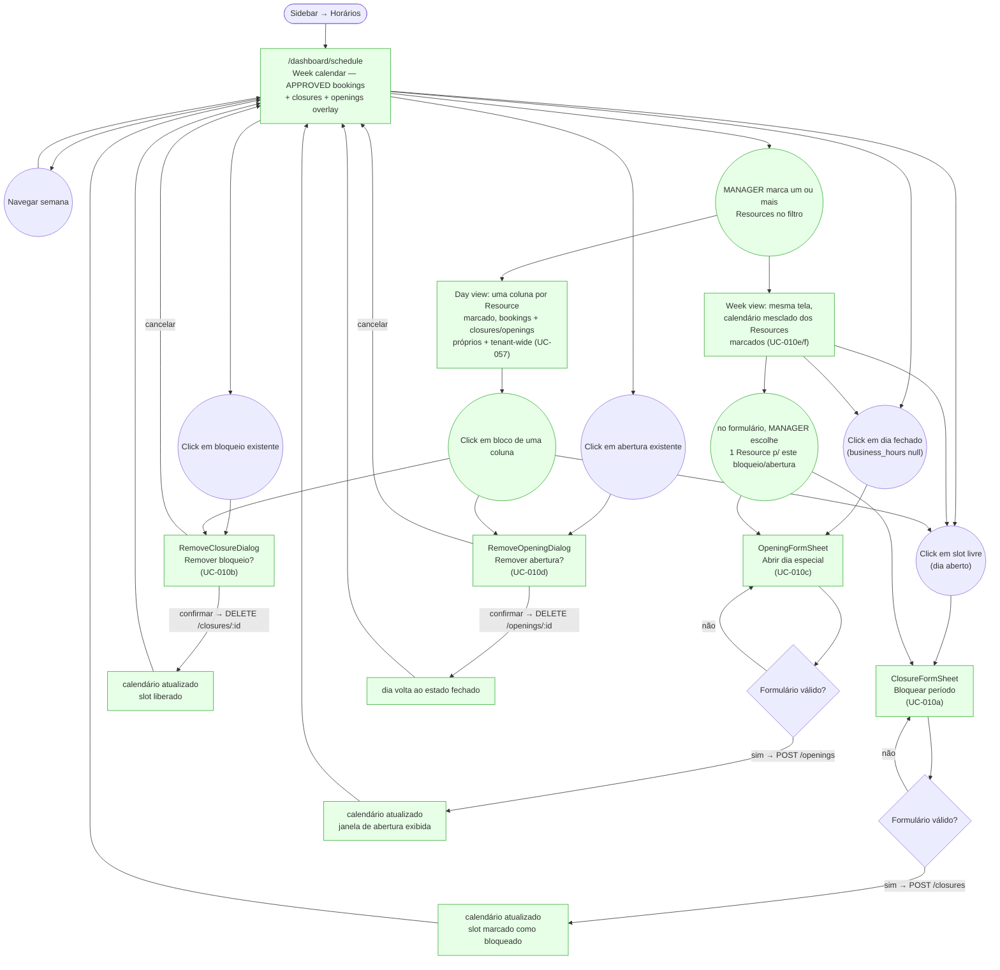

# STAFF — Horários (Schedule & Closure Management)

**Actor(s):** STAFF | MANAGER  
**Goal:** View the calendar of approved bookings and manage schedule closures and openings  
**UCs covered:** UC-010a, UC-010b, UC-010c, UC-010d, UC-010e, UC-010f, UC-057 (✅ Done — M22 Cluster 2, manager bounded multi-resource column view)  
**Status:** Done — resource-scoped extension shipped in `M21-S05`; the Cluster 2 bounded multi-resource columns board shipped in `M22-S06`, see `dev-notes.md`

## Flow

```mermaid
flowchart TD
    classDef existing fill:#e6ffe6,stroke:#3a3
    classDef gap stroke:#f00,stroke-dasharray: 5 5,fill:#fee

    Start(["Sidebar → Horários"]) --> Schedule["/dashboard/schedule<br/>Week calendar — APPROVED bookings<br/>+ closures + openings overlay"]

    Schedule --> WeekNav(("Navegar semana"))
    WeekNav --> Schedule

    Schedule --> ClickSlot(("Click em slot livre<br/>(dia aberto)"))
    ClickSlot --> ClosureSheet["ClosureFormSheet<br/>Bloquear período<br/>(UC-010a)"]
    ClosureSheet --> ClosureForm{"Formulário válido?"}
    ClosureForm -- não --> ClosureSheet
    ClosureForm -- sim → POST /closures --> ClosureSuccess["calendário atualizado<br/>slot marcado como bloqueado"]
    ClosureSuccess --> Schedule

    Schedule --> ClickClosure(("Click em bloqueio existente"))
    ClickClosure --> RemoveClosureSheet["RemoveClosureDialog<br/>Remover bloqueio?<br/>(UC-010b)"]
    RemoveClosureSheet -- cancelar --> Schedule
    RemoveClosureSheet -- confirmar → DELETE /closures/:id --> RemoveClosureSuccess["calendário atualizado<br/>slot liberado"]
    RemoveClosureSuccess --> Schedule

    Schedule --> ClickClosedDay(("Click em dia fechado<br/>(business_hours null)"))
    ClickClosedDay --> OpeningSheet["OpeningFormSheet<br/>Abrir dia especial<br/>(UC-010c)"]
    OpeningSheet --> OpeningForm{"Formulário válido?"}
    OpeningForm -- não --> OpeningSheet
    OpeningForm -- sim → POST /openings --> OpeningSuccess["calendário atualizado<br/>janela de abertura exibida"]
    OpeningSuccess --> Schedule

    Schedule --> ClickOpening(("Click em abertura existente"))
    ClickOpening --> RemoveOpeningSheet["RemoveOpeningDialog<br/>Remover abertura?<br/>(UC-010d)"]
    RemoveOpeningSheet -- cancelar --> Schedule
    RemoveOpeningSheet -- confirmar → DELETE /openings/:id --> RemoveOpeningSuccess["dia volta ao estado fechado"]
    RemoveOpeningSuccess --> Schedule

    class Schedule,ClosureSheet,ClosureSuccess,RemoveClosureSheet,RemoveClosureSuccess,OpeningSheet,OpeningSuccess,RemoveOpeningSheet,RemoveOpeningSuccess existing

    %% M21 Cluster 1 — resource-scoped extension (MANAGER-only, shipped M21-S05)
    Schedule --> ResourceFilter(("MANAGER marca um ou mais<br/>Resources no filtro"))
    ResourceFilter --> ScheduleScoped["Week view: mesma tela,<br/>calendário mesclado dos Resources<br/>marcados (UC-010e/f)"]
    ScheduleScoped --> ClickSlot
    ScheduleScoped --> ClickClosedDay
    ScheduleScoped --> ResourceFieldPick(("no formulário, MANAGER escolhe<br/>1 Resource p/ este bloqueio/abertura"))
    ResourceFieldPick --> ClosureSheet
    ResourceFieldPick --> OpeningSheet

    class ResourceFilter,ScheduleScoped,ResourceFieldPick existing

    %% M22 Cluster 2 — bounded multi-resource columns board (MANAGER-only, Day view, shipped M22-S06)
    ResourceFilter --> ScheduleColumns["Day view: uma coluna por Resource<br/>marcado, bookings + closures/openings<br/>próprios + tenant-wide (UC-057)"]
    ScheduleColumns --> ClickColumnBlock(("Click em bloco de uma coluna"))
    ClickColumnBlock --> ClickSlot
    ClickColumnBlock --> RemoveClosureSheet
    ClickColumnBlock --> RemoveOpeningSheet

    class ScheduleColumns,ClickColumnBlock existing
```

## Pages referenced

| Page / Route | Component | Story | Status |
|---|---|---|---|
| `/dashboard/schedule` | `SchedulePage` (week calendar grid) | M13-S21 | ✅ Done |
| Closure creation bottom sheet | `ClosureFormSheet` within `SchedulePage` | M13-S21 | ✅ Done |
| Closure removal confirmation | `RemoveClosureDialog` within `SchedulePage` | M13-S21 | ✅ Done |
| Opening creation bottom sheet | `OpeningFormSheet` within `SchedulePage` | M13-S21 | ✅ Done |
| Opening removal confirmation | `RemoveOpeningDialog` within `SchedulePage` | M13-S21 | ✅ Done |
| Resource filter (view) + resource-scoped calendar | `ResourceFilterMenu` within `SchedulePage` | M21-S05 | ✅ Done (M21 Cluster 1, UC-010e/f) |
| Resource field (write, per action) | `ResourceSelectField` within `ClosureFormSheet`/`OpeningFormSheet` | M21-S05 | ✅ Done (M21 Cluster 1, UC-010e/f) |

## BFF calls (verified — all implemented)

| Operation | Method | Path | Guard |
|---|---|---|---|
| List closures | `GET` | `/v1/schedule/closures` | STAFF \| MANAGER |
| Create closure | `POST` | `/v1/schedule/closures` | STAFF \| MANAGER |
| Remove closure | `DELETE` | `/v1/schedule/closures/:id` | STAFF \| MANAGER |
| List openings | `GET` | `/v1/schedule/openings` | STAFF \| MANAGER |
| Create opening | `POST` | `/v1/schedule/openings` | STAFF \| MANAGER |
| Remove opening | `DELETE` | `/v1/schedule/openings/:id` | STAFF \| MANAGER |
| List approved bookings (for calendar display) | `GET` | `/v1/bookings?status=APPROVED` | STAFF \| MANAGER |
| **M21 Cluster 1:** list/create with `resourceId` | `GET`/`POST` | `/v1/schedule/closures`, `/v1/schedule/openings` — `resourceId` optional field/query param | STAFF\|MANAGER unscoped; **MANAGER only** when `resourceId` is set |
| **M21 Cluster 1:** list resources for the filter menu / resource field | `GET` | `/v1/resources?type=&isActive=` | MANAGER |

## ScheduleClosure form fields (UC-010a)

| Field | Type | Required | Validation |
|---|---|---|---|
| `date` | date picker | ✅ | not in the past |
| `reason` | enum select: `STAFF_DAY_OFF` \| `MAINTENANCE` \| `HOLIDAY` | ✅ | one of three values |
| `startTime` | time input | ❌ (null = full-day) | if provided, `endTime` must also be provided |
| `endTime` | time input | ❌ (null = full-day) | must be > `startTime` |
| `notes` | text area | ❌ | max 200 chars |

**Error states (from UC-010a alt flows):**
- `422` date in the past → "Não é possível bloquear datas passadas."
- `409` overlapping closure → "Já existe um bloqueio nesse período."
- `409` full-day vs. partial conflict → "Conflito com bloqueio parcial existente na mesma data."
- Warning (not blocking): approved bookings exist in the window → "[X] agendamentos existem nesse período. Reagende ou cancele manualmente."

## ScheduleOpening form fields (UC-010c)

| Field | Type | Required | Validation |
|---|---|---|---|
| `date` | date picker (closed days only) | ✅ | not in the past; day-of-week must be null in `business_hours` |
| `startTime` | time input | ✅ | |
| `endTime` | time input | ✅ | must be > `startTime` |
| `notes` | text area | ❌ | max 200 chars |

**Error states (from UC-010c alt flows):**
- `422` date in the past → "Não é possível abrir datas passadas."
- `422` day already open in `business_hours` → "Esse dia já está aberto nas configurações regulares. Ajuste os horários de funcionamento em vez disso."
- `409` opening already exists for this date → "Já existe uma abertura para esta data."

## Open questions / gaps

- [x] **Calendar granularity** — should the Horários view be a week grid (Mon–Sun columns, hourly rows) or a day view with time blocks? — **Resolved (`M13-S21`).** Week strip (Mon–Sun day buttons) with a day strip selector, plus a time grid below for the selected day's slots (per `businessHours`).
- [x] **APPROVED booking display** — bookings appear as colour-coded time blocks on the calendar. What colour? Does clicking a block navigate to the booking detail? — **Resolved (`M13-S21`).** Blue left border + `--ba-secondary` background; links to `/dashboard/bookings/[id]`.
- [x] **Closure visual** — how are closures rendered? — **Resolved (`M13-S21`).** Grey hatched overlay (`repeating-linear-gradient 135deg`); a booking inside a closure window gets an orange tint + warning icon (UC-010a A4).
- [x] **Normally-closed day entry** — how does staff reach the "Abrir dia especial" sheet? — **Resolved (`M13-S21`).** Closed days show an empty state with an "Abrir dia especial" CTA that opens `OpeningFormSheet` (replaces the FAB on those days).
- [x] **Warning for bookings in blocked window** — UC-010a A4 says "show warning." Is this blocking or non-blocking? — **Resolved (`M13-S21`).** Non-blocking inline warning banner shown after the closure is created: "[X] agendamento(s) aprovado(s) existe(m) nesse período. Reagende ou cancele manualmente."
- [x] **BFF `.http` gap** — `apps/bff/http/schedule/` has `schedule-closures.http` but is missing `schedule-openings.http` and `availability.http`. — **Resolved/assigned.** `M13-S21` explicitly creates both files as part of its own scope (no longer a "should be created" — it's now a concrete deliverable).
- **Story assignment** — confirmed: `M13-S21` ("Horários: schedule management page + closure/opening flows") is the assigned story. Scope: `ScheduleView`/`SchedulePage`, `ClosureFormSheet`, `RemoveClosureDialog`, `OpeningFormSheet`, `RemoveOpeningDialog`.

## M21 — Multi-Vertical Scheduling, Cluster 1 extension (✅ Done — `M21-S05`)

> Promoted from `docs/discovery/multivertical-booking/`. Covers UC-010e (resource-scoped closure) and UC-010f (resource-scoped opening) — see `docs/02-DOMAIN_MODEL.md` § Booking Context (`Resource` aggregate), `docs/13-DATABASE_SCHEMA.md`, `docs/14-API_CONTRACTS.md`. `07-horarios-recurso.html` (discovery-only illustrative material, not a validated `plan/journey/` prototype) informed the mechanism but not the final UI, which instead followed this file's own mermaid flow and `dev-notes.md`'s GAP section — see `M21-S05`'s story-discovery notes (`plan/M21-MULTIVERTICAL-FOUNDATION.md`) for the full resolution. Full implementation-handoff detail lives in `dev-notes.md`.

- [x] Shipped in `M21-S05` as **two separate controls**, not one picker (revised mid-implementation, after live testing showed a single-select picker couldn't answer "show me everyone's schedule at once" — a real manager need):
  - **`ResourceFilterMenu`** — a floating, multi-select checkbox filter at the top of the existing `/dashboard/schedule` route (`SchedulePage`), mirroring the existing `ScheduleStatusFilterMenu`'s own trigger+popover shape. Controls what the *calendar view* shows: zero resources checked = today's exact tenant-wide behavior (unchanged default); one or more checked = that resource's own closures/openings merged into the same timeline, in addition to the tenant-wide ones (which always apply regardless) — this merged-timeline behavior for closures/openings is what M21-S05 shipped and still applies to **Week view** today. **Day view instead shows the M22 Cluster 2 bounded columns board below** once M22-S06 shipped it (one column per checked resource, not a merged single timeline) — see that section for the current Day-view behavior. Week view's *bookings* (as opposed to closures/openings) later gained their own resource-filtering behavior — see the TD44 addition below.
  - **`ResourceSelectField`** — a single-select field embedded inside `ClosureFormSheet`/`OpeningFormSheet`, deliberately decoupled from the filter menu's selection. It decides which *one* resource a new block/opening applies to (`resourceId` is a single nullable field on the aggregate, not a list), and always starts fresh at "Todo o negócio" each time a sheet opens — it does not inherit whatever is currently checked in the view filter.
  - Both are MANAGER-only (rendered only for `role === 'MANAGER'`, sourced via the dashboard-wide `TenantProvider`) and both exclude the tenant's own `LOCATION` resource from their options — `resourceId = null` ("Todo o negócio") already represents that scope.
- [x] This extension is **MANAGER-only** when `resourceId` is set (a deliberate, self-consistent restriction the discovery applies to the whole Resource Management surface — no existing precedent to derive it from); the existing tenant-wide flow (UC-010a–d) stays open to STAFF|MANAGER, unchanged.
- [ ] Pre-existing navigation gap found during this promotion, not fixed here: `07-horarios-recurso.html`'s sidebar/bottom-nav has 3 links pointing at Cluster 2/4 screens not yet promoted (`manager-05-visao-geral.html`, `manager-02-service-resource-config.html`, `staff-04-turmas-proximas.html`) — resolves once those clusters land. Moot for the shipped design since it never navigates to that illustrative screen at all, but left unresolved for whenever that file is revisited.

## M22 Cluster 2 addition — UC-057 (Manager bounded multi-resource column view, ✅ Done — `M22-S06`)

> "Horários" is role-adaptive: a STAFF viewer keeps the tenant-wide timeline above, unchanged (UC-010a–d — resource scoping stays MANAGER-only per `M21-S05`, the picker itself is never rendered for STAFF); a MANAGER viewer who checks one or more resources in "Filtrar recurso", in Day view, gets a bounded columns board instead — one column per checked resource, no new nav item, same "Horários" entry. (Week view's own behavior evolved separately afterward — see the TD44 addition below.) Prototype: `08-visao-geral-manager.html` (relocated from `manager-05-visao-geral.html`, redesigned 2026-09-24 from an unbounded "every active resource" grid to this bounded, checkbox-driven column view). BFF: `GET /v1/schedule/day-grid?date=` (`docs/14-API_CONTRACTS.md`, shipped `M22-S05`), MANAGER only — used purely as a `resourceId → booking-id` lookup, not a separate rendering source; see `dev-notes.md`.

- [x] Assigned to `M22-S06` — see `plan/M22-MULTIVERTICAL-SERVICE-AVAILABILITY.md`.
- [x] Route-level relationship to Cluster 1's resource-scoped timeline — **resolved during `M22-S06`'s own `/story-discovery` (2026-09-24):** no separate page/route. The columns board renders inline within the existing `/dashboard/schedule` route's Day view, replacing `ScheduleTimelineBoard` only when one or more resources are checked in the same `ResourceFilterMenu` Cluster 1 already shipped. Week view was untouched by M22-S06 itself — see the TD44 addition below for its later, separate change.
- [x] Shipped `M22-S06` — `ScheduleMainView.tsx`/`ScheduleResourceColumnsBoard.tsx`/`schedule-resource-columns.ts` (`apps/web/features/booking/`). See `dev-notes.md` for the full file map.

## TD44 addition — Week view resource-filtered bookings + compact resource-summary line (✅ Done — `TD44` Story 1, Story 2)

> Closes the gap M22-S06 left open: Week view's merged timeline already reflected checked resources for closures/openings (`M21-S05`), but never for bookings — unlike Day view's columns board, which narrows *and* labels bookings by resource. `TD44` Story 1 (`td/TD44-RESOURCE-COLUMNS-BOARD-SELECTION-CAP.md`) makes Week view behave consistently with Day view through filtering + labeling in its existing merged day-card shape, not a new columns layout (7 days × N columns doesn't fit). `TD44` Story 2 then replaced Story 1's own per-resource badge row with a fixed-shape single line, closing an overflow risk Story 1 itself flagged.

- [x] Design locked in via `/story-discovery` (2026-09-24): zero resources checked = unchanged default (same as Day view); one or more checked = a booking shows only if ≥1 of its assigned resources is checked.
- [x] Resolved via the already-shipped `GET /schedule/day-grid` (`M22-S05`), reused purely as a client-side `resourceId → booking-id` lookup across the 7 visible days — **no backend/DTO change.** This is a deliberately different mechanism from the badge idea rejected during `M22-S06`'s own discovery (see `dev-notes.md`'s "rejected intermediate idea" note): that idea needed new backend plumbing because `StaffBookingCardResponse` had no resource field; this one never touches the DTO, since resource identity comes from the day-grid response instead.
- [x] Inherits `TD43`'s cross-midnight day-grid membership gap (same root cause as the Day-view columns board) — not re-fixed here, flagged as a shared known limitation.
- [x] Shipped `TD44` Story 1 — `useSchedule.ts`, `schedule-week-resource-bookings.ts`, `schedule-timeline-events.ts`, `schedule-timeline.ts`, `schedule-timeline-formatting.ts`, `ScheduleTimelineEventRenderer.tsx`, `schedule-page-core-data.ts`/`schedule-page-timeline-derived.ts`/`schedule-page-query-data.ts` (`apps/web/features/booking/`). **No changes needed** to `ScheduleMainView.tsx`/`ScheduleWeekView.tsx` — filtering/badging happen in the data layer, before either component ever sees the events. See `dev-notes.md` for the full file map.
- [x] **`TD44` Story 2 (`/story-discovery` 2026-09-25) — compact resource-summary line, replacing Story 1's per-resource badge row:** Story 1 originally labeled a matched booking with one `ResourceNameBadge` per matched resource, wrapped inline next to the status badge — unbounded height growth as match count grew, a risk Story 1's own implementation notes flagged as unverified. Story 2 closes it by design: the block's title/subtitle/status row is unchanged, and a single new line is added directly below it (divider, then the line; the existing time-range text moves below this new line), showing nothing for 0 matches, just the name for exactly 1 match, or the type-prioritized name (**STAFF > ROOM > EQUIPMENT**, alphabetical tiebreak within the same type) + a `+N` count of the rest for 2+ matches (e.g. 3 matched resources → "Camila +2"). The line carries an `aria-label` listing every matched name, not just the visible one, for screen readers. `data-testid="timeline-block-resource-summary"` (the old `timeline-block-resource-name` testid stays reserved for openings/closures, which are untouched by this story). Shipped: `schedule-resource-priority.ts` (new — type-priority comparator), `schedule-page-core-data.ts` (new `resourceTypeById` lookup), `schedule-page-timeline-derived.ts` (comparator wired into `buildBookingResourceNamesById`), `BookingResourceSummaryLine.tsx` (new — the rendered line, extracted from `ScheduleTimelineEventRenderer.tsx` to stay under the file-length cap).
