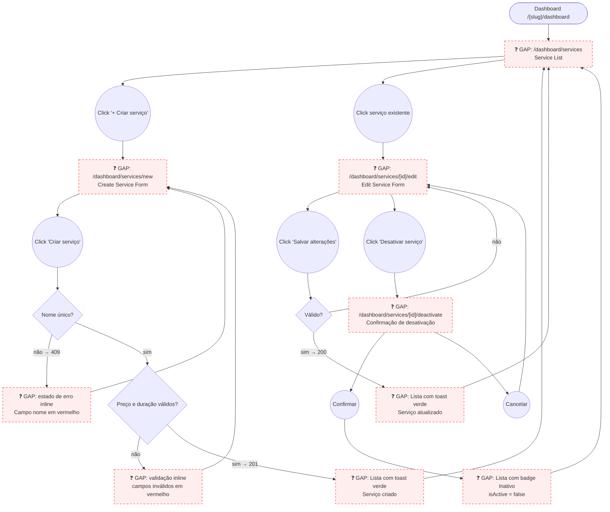

# STAFF — Serviços (Service Catalog Management)

**Actor(s):** STAFF | MANAGER  
**Goal:** Create, edit, and deactivate services offered by the tenant  
**UCs covered:** UC-012, UC-013  
**Status:** Draft

## Flow

## Pages referenced

| Page / Route | Component | Story | Status |
|---|---|---|---|
| `/dashboard/services` | `ServiceListPage` | M13-S22 | ✅ Done |
| `/dashboard/services/new` | `ServiceFormPage` (create mode) | TBD | 📋 Gap |
| `/dashboard/services/[id]/edit` | `ServiceFormPage` (edit mode) | TBD | 📋 Gap |
| Deactivate confirmation | `DeactivateServiceSheet` or sub-route | TBD | 📋 Gap |

## Open questions / gaps

- [x] **Route location** — are service pages under `/dashboard/services/` or `/[slug]/dashboard/services/`? — **Resolved.** `/dashboard/services` (no slug) — `M13-S22`/`M13-S23`/`M13-S24` all use this, consistent with every other M13 dashboard route.
- [ ] **Create as inactive** — UC-012 field list includes `isActive` (default: true). Does the create form expose a toggle to create a service as inactive from the start? Useful for drafting services before publishing.
- [ ] **Deactivate UX** — prototype uses a dedicated confirmation page. Production could use a bottom sheet on the edit form instead. Confirm preference.
- [ ] **Reactivate** — UC-013 covers deactivation but not reactivation. Can staff toggle `isActive = true` on an inactive service via the edit form? The PATCH endpoint supports it (same `update()` method). Clarify if reactivation is in scope.
- [ ] **Service ordering** — does the service list have a drag-to-reorder or fixed sort (e.g. alphabetical, creation date)? Affects the list page design.
- [ ] **`requiresPickupAddress` label** — "Coleta e Entrega" toggle in the form — should the label be the feature name ("Requer endereço de coleta") or a free-text helper?
- [ ] **Price change warning** — UC-013 A2 says past bookings are unaffected. Show an inline note on the price field? Prototype includes it; confirm if it's needed in production.

## Prototype

Folder: `staff/prototypes/servicos/`

| File | Screen | UC | Status |
|---|---|---|---|
| `index.html` | Navigation hub + dry-run checklist | — | ✅ Criado |
| `01-servicos-list.html` | Service list (active + inactive tabs) | — | ✅ Criado |
| `02-service-create.html` | Create service form | UC-012 | ✅ Criado |
| `02b-service-create-error.html` | Duplicate name error state | UC-012 A1 | ✅ Criado |
| `02c-service-create-success.html` | Service created — inline success banner on the list (closes the "Lista com toast verde" gap node) | UC-012 | ✅ Criado |
| `03-service-edit.html` | Edit service form + deactivate button | UC-013 | ✅ Criado |
| `03b-deactivate-confirm.html` | Deactivation confirmation | UC-013 A1 | ✅ Criado |
| `dev-notes.md` | Implementation handoff | — | ✅ Criado |
