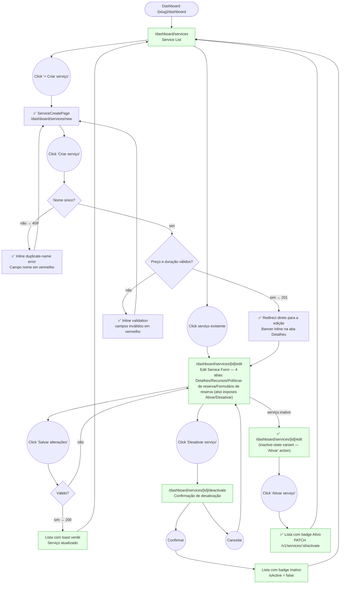

# STAFF — Serviços (Service Catalog Management)

**Actor(s):** STAFF | MANAGER  
**Goal:** Create, edit, and deactivate services offered by the tenant  
**UCs covered:** UC-012, UC-013 (shipped, `M13-S22`–`S24`) · UC-050, UC-051, UC-052, UC-053, UC-054, UC-055, UC-056 (❓ Gap — M22 Cluster 2, resource requirements/bundles/legs/buffer/intake-schema/booking-policy/booking-model extensions)  
**Status:** Base CRUD done — M22 Cluster 2 extension not yet built, see the ❓ GAP section in `dev-notes.md`

## Flow

```mermaid
flowchart TD
    classDef existing fill:#e6ffe6,stroke:#3a3
    classDef gap stroke:#f00,stroke-dasharray: 5 5,fill:#fee

    Start(["Dashboard /{slug}/dashboard"]) --> List["/dashboard/services<br/>Service List"]

    List --> CreateBtn(("Click '+ Criar serviço'"))
    List --> EditClick(("Click serviço existente"))

    %% UC-012 — Create
    CreateBtn --> CreateForm["✅ ServiceCreatePage<br/>/dashboard/services/new"]
    CreateForm --> CreateSubmit(("Click 'Criar serviço'"))
    CreateSubmit --> NameCheck{"Nome único?"}
    NameCheck -- "não → 409" --> NameError["✅ Inline duplicate-name error<br/>Campo nome em vermelho"]
    NameError --> CreateForm
    NameCheck -- "sim" --> PriceCheck{"Preço e duração válidos?"}
    PriceCheck -- "não" --> ValError["✅ Inline validation<br/>campos inválidos em vermelho"]
    ValError --> CreateForm
    PriceCheck -- "sim → 201" --> CreateSuccess["✅ Redirect direto para a edição<br/>Banner inline na aba Detalhes"]

    %% UC-013 — Edit
    EditClick --> EditForm["/dashboard/services/[id]/edit<br/>Edit Service Form — 4 abas: Detalhes/Recursos/Políticas de reserva/Formulário de reserva (also exposes Ativar/Desativar)"]
    EditForm --> EditSubmit(("Click 'Salvar alterações'"))
    EditSubmit --> EditCheck{"Válido?"}
    EditCheck -- "não" --> EditForm
    EditCheck -- "sim → 200" --> EditSuccess["Lista com toast verde<br/>Serviço atualizado"]

    EditForm --> DeactivateBtn(("Click 'Desativar serviço'"))
    DeactivateBtn --> DeactivateConfirm["/dashboard/services/[id]/deactivate<br/>Confirmação de desativação"]
    DeactivateConfirm --> ConfirmYes(("Confirmar"))
    DeactivateConfirm --> ConfirmNo(("Cancelar"))
    ConfirmYes --> DeactivateSuccess["Lista com badge Inativo<br/>isActive = false"]
    ConfirmNo --> EditForm

    %% UC-013 A4 — Reactivate (inactive service)
    EditForm -- "serviço inativo" --> InactiveEdit["✅ /dashboard/services/[id]/edit<br/>(inactive-state variant — 'Ativar' action)"]
    InactiveEdit --> ActivateBtn(("Click 'Ativar serviço'"))
    ActivateBtn --> ActivateSuccess["✅ Lista com badge Ativo<br/>PATCH /v1/services/:id/activate"]

    CreateSuccess --> EditForm
    EditSuccess --> List
    DeactivateSuccess --> List
    ActivateSuccess --> List

    class List,EditForm,DeactivateConfirm,EditSuccess,DeactivateSuccess,InactiveEdit,ActivateSuccess existing
```

## Pages referenced

| Page / Route | Component | Story | Status |
|---|---|---|---|
| `/dashboard/services` | `ServiceListPage` | M13-S22 | ✅ Done |
| `/dashboard/services/new` | `ServiceCreatePage` | M13-S23 | ✅ Done |
| `/dashboard/services/[id]/edit` | `ServiceEditPage` | M13 | ✅ Done |
| Deactivate confirmation | `ServiceDeactivatePage` (`/dashboard/services/[id]/deactivate`) | M13 | ✅ Done |

## Open questions / gaps

- [x] **Route location** — are service pages under `/dashboard/services/` or `/[slug]/dashboard/services/`? — **Resolved.** `/dashboard/services` (no slug) — `M13-S22`/`M13-S23`/`M13-S24` all use this, consistent with every other M13 dashboard route.
- [x] **Create as inactive** — UC-012 field list includes `isActive` (default: true). The create form now exposes the toggle and defaults it to ON.
- [ ] **Deactivate UX** — prototype uses a dedicated confirmation page. Production could use a bottom sheet on the edit form instead. Confirm preference.
- [x] **Reactivate** — **Resolved/shipped.** `ServiceEditPage` includes a `ServiceEditStatusSection` with an "Ativar serviço" action (via a `useActivateService` hook) wired to the same `PATCH` endpoint.
- [ ] **Service ordering** — does the service list have a drag-to-reorder or fixed sort (e.g. alphabetical, creation date)? Affects the list page design.
- [ ] **`requiresPickupAddress` label** — "Coleta e Entrega" toggle in the form — should the label be the feature name ("Requer endereço de coleta") or a free-text helper?
- [ ] **Price change warning** — UC-013 A2 says past bookings are unaffected. Show an inline note on the price field? Prototype includes it; confirm if it's needed in production.

## Prototype

Folder: `staff/prototypes/servicos/`

| File | Screen | UC | Status |
|---|---|---|---|
| `index.html` | Navigation hub + dry-run checklist | — | ✅ Criado |
| `01-servicos-list.html` | Service list (active + inactive tabs) | — | ✅ Criado |
| `02-service-create.html` | Create service form | UC-012 | ✅ Criado |
| `02b-service-create-error.html` | Duplicate name error state | UC-012 A1 | ✅ Criado |
| `02c-service-create-success.html` | Service created — redirects straight to the edit page (Detalhes tab, inline success banner), all 4 tabs unlocked showing their empty/default state | UC-012 | ✅ Criado — redesigned 2026-09-17, was previously a banner on the list page |
| `03-service-edit.html` | Edit service form — 4 tabs: Detalhes (UC-013, shipped) · Recursos (UC-050–053) · Políticas de reserva (UC-055) · Formulário de reserva (UC-054) | UC-013, 050–055 | Detalhes ✅ Criado · other 3 tabs ❓ Gap (M22 Cluster 2) |
| `03b-deactivate-confirm.html` | Deactivation confirmation | UC-013 A1 | ✅ Criado (still branded for the pre-M22 protagonist — see `dev-notes.md`'s known follow-up) |
| `03c-service-edit-inactive.html` | Edit form, inactive-service variant — same 4 tabs as `03`, "Ativar" action instead of Salvar+danger-zone on Detalhes (reactivation, shipped 2026-07-31; rebuilt with tabs 2026-09-17) | UC-013 A4 | ✅ Criado |
| `03d-service-edit-policy-error.html` | Error — variable duration without pricing policy (Políticas de reserva tab) | UC-055 A2 | ❓ Gap (M22 Cluster 2) |
| `03e-service-edit-intake-error.html` | Error — booking-intake form with 0 questions and no consent text (Formulário de reserva tab) | UC-054 | ❓ Gap (M22 Cluster 2) — added 2026-09-17 |
| `dev-notes.md` | Implementation handoff | — | ✅ Criado |

Note: the booking-model picker for UC-056 (Agendamento/Turma, at creation time) lives on `02-service-create.html`, not a separate file — see that file's own header comment.

## M22 — Multi-Vertical Scheduling, Cluster 2 extension (❓ Gap, not yet built)

> Promoted from `docs/discovery/multivertical-booking/`. Full implementation-handoff detail lives in `dev-notes.md`'s own ❓ GAP section — not duplicated here.

- [x] Assigned to `M22-S04` — see `plan/M22-MULTIVERTICAL-SERVICE-AVAILABILITY.md`.
- [x] UC-054 (booking-intake schema) now has a prototype screen — `03-service-edit.html`'s "Formulário de reserva" tab (redesigned 2026-09-17, replacing the old separate-page structure and the 2 flat checkboxes that used to stand in for the whole schema) — still confirm the exact layout with the user during `/story-discovery M22-S04`, it's genuinely new UI.
- [ ] **Real functional gap** (not just a prototype gap): no `GET` endpoint exists to read a service's active intake schema or version history — flagged in `dev-notes.md` and `docs/02-DOMAIN_MODEL.md` § Aggregate: ServiceBookingIntakeSchema. Needs a scope decision at `/story-discovery M22-S04`.
- [ ] UC-056's SESSION branch (declaring `classResourceSlots`) is schema-only in this cluster — not actionable until Cluster 4 ships `ClassScheduleTemplate`. The creation-time Agendamento/Turma picker itself (UC-056 main flow) now has a real prototype on `02-service-create.html`.
- [x] **UX decision, 2026-09-17 (user-proposed):** `POST /services` success now redirects straight to the edit page (Detalhes tab, inline banner, all 4 tabs unlocked) instead of back to the list — see `02c-service-create-success.html`'s own header comment. This also produced the first prototype screens showing Recursos/Políticas de reserva/Formulário de reserva in their **empty/default state** (no resource requirements, policy fields inheriting tenant defaults, no intake schema published) — `03-service-edit.html` only ever modeled the fully-configured case.
- [x] **Field-completeness audit, 2026-09-17:** `03-service-edit.html`'s Recursos and Políticas de reserva tabs were checked field-by-field against the real Zod contracts (`ResourceRequirementSchema`, `UpdateServiceBookingPolicySchema` in `packages/validation/src/booking.ts`) and were missing real, independently-submittable fields — fixed: `requiredQuantity` per resource type (Recursos), and on Políticas de reserva: `minBookingAdvanceHoursOverride`/`maxBookingAdvanceDaysOverride` ("Janela de reserva" card) plus the full duration-policy (`durationMinMinutes`/`Max`/`IncrementMinutes`) and pricing-policy (`pricingIncrementMinutes`/`pricePerIncrementAmount`/`minimumChargeAmount`) detail fields, previously collapsed into one disabled `<select>` showing a single pre-baked string. Also made `fieldKey` (Formulário de reserva) visible as an auto-derived, read-only value instead of a silently-omitted required field.
- [x] **UX heuristic review, 2026-09-17 (round 2):** full pass across every file, checked against usability heuristics (not just docs/contracts). Found and fixed 2 critical issues — no per-tab dirty-state visibility combined with every "Salvar" navigating to the list (would have forced a manager to re-open the service after every single tab, defeating the point of tabs) and no unsaved-changes warning on navigating away — plus `02b`'s missing booking-model picker, `03c`'s complete lack of the 4-tab structure, a missing "Turma" badge + a wrong link on the list page, a missing intake-schema error state, an incorrect "disabled/inherited" treatment on the buffer field, and 3 smaller polish items (merged Duração/Preço cards, ARIA roles, mobile tab labels). Full detail in `dev-notes.md`'s own "UX review fixes, round 2" section.
