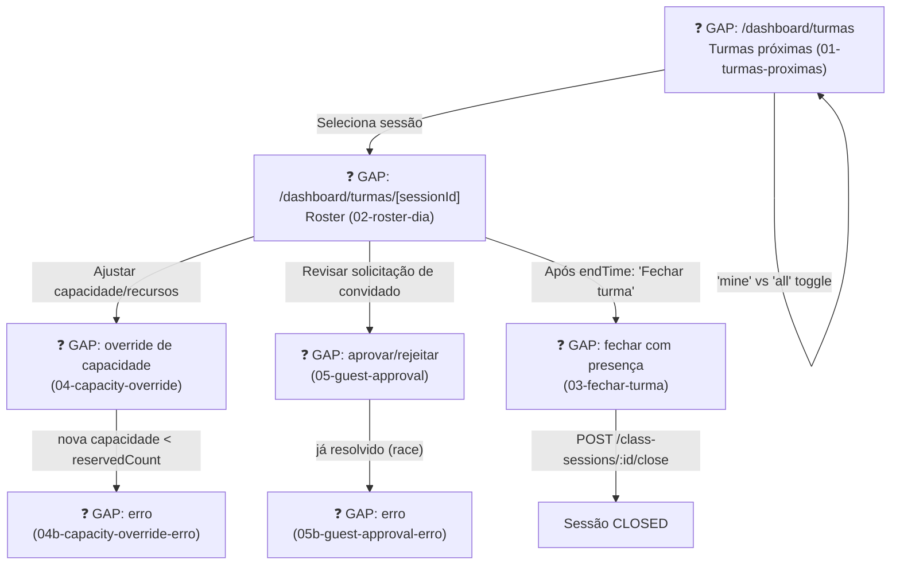

# STAFF — Turmas (Daily Class Operations)

**Actor(s):** STAFF | MANAGER  
**Goal:** View upcoming class sessions, manage a session's roster (capacity override, guest approval, close-out with attendance and optional manual charge record)  
**UCs covered:** UC-082 (list), UC-083 (capacity override), UC-091 (waitlist promotion, staff-triggered entry point), UC-098 (guest approval), UC-101 (close-out)  
**Status:** ❓ Gap — M21, Multi-Vertical Scheduling, Cluster 4 (Classes/Sessions). No story assigned yet.

> Promoted from `docs/discovery/multivertical-booking/multivertical-booking_USECASES.md` (CAND-13b, 14, 34, 37) via `/discovery-to-milestone`. Mirrors `staff/agenda.md`'s own shape for private appointments — a list first, then a detail/roster page per item. `manager-roster-dia.html` is the single canonical roster screen (superseding an earlier, independently-built `staff-02-session-roster.html` — see `docs/discovery/multivertical-booking/prototype/dev-notes.md` item 41 for the reconciliation rationale), despite its discovery-era "manager-" filename prefix; the actual actor is STAFF|MANAGER shared, so it lives here per this repo's staff-vs-manager folder convention (`plan/journey/README.md` § Why MANAGER, not ADMIN).

## Flow

## Pages referenced

| Page / Route | Component | Story | Status |
|---|---|---|---|
| `/dashboard/turmas` | `ClassSessionListPage` | — | ❓ GAP |
| `/dashboard/turmas/[sessionId]` | `ClassSessionRosterPage` | — | ❓ GAP |
| `/dashboard/turmas/[sessionId]/close` | `ClassSessionCloseOutPage` | — | ❓ GAP |

## BFF calls in this flow

| Call | When | Roles |
|---|---|---|
| `GET /v1/class-sessions?scope=mine\|all&from=&to=` | Session list page load (UC-082) | STAFF \| MANAGER |
| `PATCH /v1/class-sessions/:id` | Capacity/resource override (UC-083) | STAFF \| MANAGER |
| `POST /v1/class-session-bookings/:id/approve` / `.../reject` | Guest approval (UC-098) | STAFF \| MANAGER |
| `POST /v1/class-sessions/:id/close` | Close-out with attendance (UC-101) | STAFF \| MANAGER |
| `POST /v1/class-session-bookings/:id/payment` | Manual charge record at close-out (UC-107) | STAFF \| MANAGER |

Full request/response shapes: `docs/14-API_CONTRACTS.md` § Classes & Sessions.

## Prototype

Folder: `staff/prototypes/turmas/` — relocated from `docs/discovery/multivertical-booking/prototype/{staff-04-turmas-proximas,manager-roster-dia,staff-02b-fechar-turma,staff-03,staff-03b,staff-06,staff-06b}.html`.

| File | Screen | UC | Status |
|---|---|---|---|
| `01-turmas-proximas.html` | Lista de turmas próximas (mine/all toggle) | UC-082 | ❓ GAP |
| `02-roster-dia.html` | Roster do dia — check-in, fila de espera, aprovação de convidado, drop-in | UC-091/098 | ❓ GAP |
| `03-fechar-turma.html` | Fechar turma — presença individual + cobrança manual opcional | UC-101/107 | ❓ GAP |
| `04-capacity-override.html` / `04b-capacity-override-erro.html` | Override de capacidade/recursos + erro | UC-083 | ❓ GAP |
| `05-guest-approval.html` / `05b-guest-approval-erro.html` | Aprovar/rejeitar reserva de convidado + erro (race) | UC-098 | ❓ GAP |

**Superseded, kept for historical reference only (not relocated):** `staff-02-session-roster.html` — the original STAFF-only roster screen, merged into `02-roster-dia.html` as the single canonical STAFF|MANAGER-shared roster (see `docs/discovery/multivertical-booking/prototype/dev-notes.md` item 41).

**Not relocated, no direct use case:** `manager-dashboard.html` and `manager-agenda-dia.html` — discovery-stage "daily operation" screens with no corresponding CAND in the promoted use-case catalogue. `manager-agenda-dia.html` in particular overlaps with UC-057's already-promoted combined day grid (`staff/prototypes/horarios/08-visao-geral-manager.html`, M21 Cluster 2). Left in the discovery folder as illustrative-only; not part of this milestone's scope.

## Open questions / gaps

- [ ] No story exists yet — needs `/story-discovery` once the M21 milestone file is drafted.
- [ ] Whether `02-roster-dia.html`'s live check-in toggle and "+ Drop-in" action correspond to a use case beyond UC-091/098, or are UI sugar over existing capacity-check flows, is worth confirming during `/story-discovery`.
