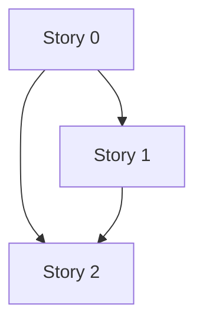

# TD41 — Agent Context Slimming (`.copilot/context.md`)

## Status

- **Type**: Technical Debt / Agent Context Hygiene
- **Priority**: Medium (every agent session pays the cost; no correctness defect)
- **Context**: `.copilot/context.md` (symlinked as `CLAUDE.md` / `AGENTS.md` / `gemini.md`), `docs/*`, `packages/architecture-check`
- **Created**: 2026-09-20
- **Discovered**: M22-S04 session review, 2026-09-20 — `/context` showed memory files at ~24.8k tokens; an audit of the file followed.
- **Decision status**: Ready for discovery in the order below; each story still begins with `/story-discovery`.
- **Related**: TD37 (architecture-check conventions), `docs/STORY_SCHEMA.md`, `docs/DEFINITION_OF_DONE.md` (stale-reference sweep)

## Problem

`.copilot/context.md` is loaded into every agent session (Claude, Codex, Gemini — one canonical file by design). Measured 2026-09-20: **512 lines, 62,935 chars** (harness-reported ~24.8k tokens for memory files).

- §7 Engineering Rules is **126 lines / 29,067 chars — 46% of the file**. It holds 37 "Critical code invariants" bullets averaging 413 chars (longest 1,082), where the _rule_ is one sentence and the rest is rationale that the pointed-to doc already holds.
- 34 of the 37 bullets already end with `→ docs/… § …`; **32 resolve, 1 is broken** (`docs/15-HOTSITE_DYNAMIC_ARCHITECTURE.md § implicit vs. explicit CSS defaults`); 3 bullets have no pointer.
- Story history is not the driver (0 PR numbers and 0 milestone tags in the invariants; ~9 dates file-wide — e.g. the Snyk-removal paragraph, "Trimmed from 20 to 11", "decided 2026-07-23 per TD31").
- Nothing stops regrowth: the file grew again in the same session that identified the problem.

**Why this matters:** every session spends context on rationale it rarely needs, diluting the gates that must not be missed; a broken pointer silently drops a rule's detail; without a guard the file only grows.

## Chosen approach (decided in this session, 2026-09-20 — not yet via story-discovery)

**Keep-in-file test.** A rule stays in `context.md` only if (a) it is a non-negotiable gate/invariant (§0, §2, §9 verbatim), (b) it is CI-enforced (name + one line), or (c) it is a _writing-time trap_ an agent hits before it would think to load a doc — trigger + rule in ≤ 2 lines. Everything else becomes a pointer; the _why_, examples and history live in the target doc.

**Safety net before any cut:** a mechanical guard (required anchors, resolvable pointers, no PR#/ISO dates, per-section budgets as a ratchet) plus a set of named trap scenarios evaluated against the file before and after.

Rejected: deleting bullets and relying on §10's task→docs table (writing-time traps aren't loaded until the agent knows to look); reword-only compression (moves nothing, unverifiable); a size cap alone (invites deleting rules to pass).

### Stories

- Story 0 — guard + trap scenarios (foundation)
- Story 1 — slim §7 (depends on 0)
- Story 2 — slim the rest + final budget (depends on 0, 1)

### Story 0 — Agent-context guard: detector, ratchet policy, trap scenarios 🟡

**Agent:** `devops` + `backend-ts`
**Complexity:** M
**Docs to load:** `docs/TD37-ARCHITECTURE-CHECK-DECISIONS.md` (detector + policy discipline), `docs/08-TESTING_STRATEGY.md`, `.copilot/context.md` §0/§2/§7/§9, `docs/STORY_SCHEMA.md`
**Dependencies:** none
**Pattern:** plain composition — no named pattern applies (one detector returning the existing `ScanResult`, like every sibling in `packages/architecture-check/src/detectors/`)

**Description:**
Build the safety net before touching a rule.

1. **Detector `checkAgentContextFile`** reads `.copilot/context.md` (`scannedTargets = 1`, so the CLI's existing "zero targets" guard fails if the file moves), driven by `packages/architecture-check/agent-context-policy.json` (separate from `architecture-policy.json` to leave that registry's schema untouched): `requiredAnchors` (phrases that must exist — "Story / TD gate", "Doc/config gate", "Autonomous implementation chain", "Pre-push validation", "Workspace ownership gate", "Local verification gate", the eleven §2 invariants by number, "PR GATE", "Stuck conditions"); pointer check (every ``→ `docs/…` `` or ``→ `infra/…` `` reference must resolve to an existing file, and a `§ <heading>` must match a heading in that file by case-insensitive prefix — this would have caught today's broken pointer); `forbiddenPatterns` (`PR #\d+` and ISO dates, with an allowlist whose entries carry rationale/owner/review date); `budgets` (`maxLines`/`maxChars` for the file and per top-level section, **set at today's measured values so the guard lands green — a ratchet**: Stories 1–2 lower them to what they achieve; raising one needs a stated reason).
2. **`docs/AGENT_CONTEXT_TRAP_SCENARIOS.md`**: ~10 named scenarios, each a prompt + expected agent behavior + the rule it exercises (add a `useExisting` provider; query without `tenant_id`; network call inside `txManager.run()`; hardcode `'pt-BR'` in a protected layout; outbox event with no consumer; unescaped `%…%` LIKE; `getByText` in an E2E spec; plain `ADD CONSTRAINT CHECK` on a live table; `InsertQueryBuilder.onConflict()`; new error code without both locale entries; plus a gate scenario: an agent given a story prompt must reach `/story-discovery` first). Evaluation: run each prompt in a fresh session against the pre-slim file (`git show <base-sha>:.copilot/context.md`) and the post-slim file; any scenario that passed before and fails after means the responsible bullet's trigger was cut too far — restore it.
3. **Manifest convention** for Stories 1–2: every sentence removed from `context.md` is listed in the PR description as `removed sentence → <doc> § <heading>` (removed lines are listed mechanically with `git diff -U0 <base> -- .copilot/context.md | grep '^-'`); the destination heading must exist (or be added in the same PR). Nothing is deleted — only relocated, or justified as redundant with a cited existing line.
4. Fix the one broken pointer (repoint `docs/15 § implicit vs. explicit CSS defaults` to the real heading, or restore the heading) so the guard is green with no exception.

**Backend use case steps:** none — no runtime code.
**Backend HTTP surface:** none.
**BFF endpoint spec:** none.
**New migration / i18n keys / env vars / feature flags:** none.

**Files to create/modify:** _(existing paths verified 2026-09-20)_

- `packages/architecture-check/src/detectors/agent-context-file.ts` (new)
- `packages/architecture-check/src/detectors/agent-context-file.spec.ts` (new)
- `packages/architecture-check/agent-context-policy.json` (new)
- `packages/architecture-check/src/index.ts` (modify — export `checkAgentContextFile`)
- `packages/architecture-check/src/cli.ts` (modify — add to `results`; `cli-regression.spec.ts` does not enumerate rules, so it is unchanged)
- `docs/AGENT_CONTEXT_TRAP_SCENARIOS.md` (new)
- `.copilot/context.md` (modify — add `agent-context-file` to the "CI-enforced by `architecture-check` detectors" list; fix the broken pointer)
- `docs/15-HOTSITE_DYNAMIC_ARCHITECTURE.md` (modify only if the heading must be restored)

**Acceptance criteria — product:**

- [ ] An edit that deletes a required anchor, breaks a doc pointer, adds a PR number or non-allowlisted ISO date, or grows a section past its budget fails `pnpm architecture-check` (hence `ci:fast` and the CI Architecture validation job) with a finding naming the line.
- [ ] The guard lands green on today's file with zero broken pointers and no exception for the pointer.
- [ ] `docs/AGENT_CONTEXT_TRAP_SCENARIOS.md` defines ≥ 10 scenarios, each traceable to a rule currently in `context.md` §7/§8, and a baseline pass/fail table against the current file is recorded in the PR.

**Acceptance criteria — technical:**

- Unit:
  - [ ] `agent-context-file.spec.ts`: missing anchor; unresolvable pointer (missing file; existing file with missing `§` heading); `PR #123`; non-allowlisted ISO date; allowlisted date accepted; maxLines/maxChars/per-section overruns; `scannedTargets = 1`; zero targets when the file is absent
- Integration: none — pure file-content function, no DB
- Tenant isolation: n/a — no tenant data
- E2E: none — covered by unit; the wiring runs as `pnpm architecture-check` in CI
- [ ] Coverage ≥80% on changed code
- [ ] `tsc --noEmit` clean, lint clean

### Story 1 — Slim §7 Engineering Rules 🟡

**Agent:** `devops`
**Complexity:** L
**Docs to load:** `.copilot/context.md` §7, `docs/ENGINEERING_RULES.md`, `docs/CI_TRAPS.md`, `docs/CODE_STANDARDS.md`, `docs/AGENT_CONTEXT_TRAP_SCENARIOS.md`
**Dependencies:** Story 0
**Pattern:** plain composition — no named pattern applies (documentation relocation, no code)

**Description:**
Apply the keep-in-file test to every §7 bullet. Each becomes ``- **<trigger>** — <rule, ≤ 2 lines>. → `doc` § <heading>``; the removed rationale is moved into the target doc **only where that section lacks it** (many already hold it — then just cite). The three pointer-less bullets get pointers, and the meta bullet ("Several invariants are already fully covered…") is deleted as redundant. The Architecture bullets (e.g. the ~1 k-char race-condition primitives bullet) and the Snyk-removal paragraph (~1.4 k) shrink to trigger + pointer, the narrative moving to `docs/CI_TRAPS.md § Snyk SCA failures`. A 3-line "How to edit this file" header states the keep-in-file test. **No rule's content changes** — only relocation; a content change is raised separately. Ratchet the §7 budget in the policy to the achieved value. Run the trap scenarios before/after and put the manifest and the table in the PR description.

**Backend use case steps / HTTP surface / BFF endpoint spec:** none.
**New migration / i18n keys / env vars / feature flags:** none.

**Files to create/modify:**

- `.copilot/context.md` (modify)
- `docs/ENGINEERING_RULES.md` (modify — receives relocated rationale only where missing)
- `docs/CI_TRAPS.md` (modify — Snyk narrative + any relocated trap text)
- `docs/CODE_STANDARDS.md` (modify — only if a relocated rule belongs there)
- `packages/architecture-check/agent-context-policy.json` (modify — ratchet the §7 budget)

**Acceptance criteria — product:**

- [ ] §7 ≤ 15,000 chars (from 29,067); every invariant bullet ≤ 2 lines + pointer (the CI-enforced list ≤ 5 lines); average bullet ≤ 220 chars.
- [ ] No rule lost: the PR description carries the full manifest (removed sentence → `<doc> § <heading>`); every destination heading exists; a reviewer spot-checks ≥ 10 entries for the relocated content.
- [ ] Every trap scenario that passed against the base file still passes against the slimmed file (table in the PR).
- [ ] Zero broken pointers; all three previously pointer-less bullets now have one.

**Acceptance criteria — technical:**

- Unit: `pnpm architecture-check` green with the ratcheted §7 budget (no new test files)
- Integration: none — no code
- Tenant isolation: n/a
- E2E: none
- [ ] Coverage ≥80% on changed code — n/a, no executable code changed (one JSON value)
- [ ] `tsc --noEmit` clean, lint clean, `pnpm prettier --check .` clean

### Story 2 — Slim the rest of the file and set the final budget 🟡

**Agent:** `devops`
**Complexity:** M
**Docs to load:** `.copilot/context.md` §6/§8–§17, `.claude/commands/pr-land.md`, `.claude/commands/pre-pr.md`, `.claude/commands/run-batch.md`, `docs/REPOSITORY_STRUCTURE.md`, `docs/DEFINITION_OF_DONE.md`
**Dependencies:** Story 0, Story 1
**Pattern:** plain composition — no named pattern applies

**Description:**
Same test on the remaining weight: §9 Story Implementation Workflow (10.7k) — keep the gates verbatim (PR GATE, Step 0 rule, autonomous chain, stuck conditions, Step 10) but point to the command files for what they already hold (Step 5's long bot-finding-discipline paragraph is in `pr-land.md` Step 3; "Parallel batch execution" is in `run-batch.md`); §10 loading table (5.0k) — keep the rows, shorten verbose cells; §8 — drop the "Trimmed from 20 to 11 on…" history sentence; §11 — move the "(decided 2026-07-23 per TD31 Story 11…)" history to `docs/REPOSITORY_STRUCTURE.md`; §6 — drop "found via /docs-audit 2026-08-04"; §14 ("Canonical registry: §17") deleted and §16 merged into §17's intro. Ratchet the total budget from Story 1's actual result (target ≤ 45,000 chars / ≤ 400 lines, from 62,935 / 512 — revisit at this story's discovery; any loosening needs a stated reason), remove the allowlist entries that no longer apply, and add a one-line DoD item: a new rule goes into the target doc first and gets a `context.md` line only if it passes the keep-in-file test.

**Backend use case steps / HTTP surface / BFF endpoint spec:** none.
**New migration / i18n keys / env vars / feature flags:** none.

**Files to create/modify:**

- `.copilot/context.md` (modify)
- `docs/REPOSITORY_STRUCTURE.md` (modify — relocated §11 decision history)
- `docs/DEFINITION_OF_DONE.md` (modify — one line)
- `packages/architecture-check/agent-context-policy.json` (modify — final budgets, trimmed allowlist)

**Acceptance criteria — product:**

- [ ] `context.md` ≤ 45,000 chars and ≤ 400 lines; zero PR numbers; zero non-allowlisted ISO dates.
- [ ] Protected gates (§0, §2, §9's PR GATE / stuck conditions / Step 10) are byte-identical to the base — evidence: `git diff` restricted to those line ranges is empty (pasted in the PR).
- [ ] Every trap scenario that passed against the base file still passes, including the gate scenario (`/story-discovery` first).
- [ ] Manifest complete, as in Story 1.

**Acceptance criteria — technical:**

- Unit: `pnpm architecture-check` green with the final budgets
- Integration: none
- Tenant isolation: n/a
- E2E: none
- [ ] Coverage ≥80% on changed code — n/a, no executable code changed
- [ ] `tsc --noEmit` clean, lint clean, `pnpm prettier --check .` clean

## Self-dry-run findings (at drafting, 2026-09-20)

- **No workaround or mounting complexity:** the guard is a real detector, not a convention. Each check (anchors, pointers, patterns, budgets) maps to a failure observed today — a broken pointer exists now, and the file regrew in the same session that found the problem. A size cap alone was the rejected simpler option. `forbiddenPatterns` may be dropped if it proves noisy.
- **Open items for `/story-discovery`:**
  1. Trap scenarios are agent-run and manual here; automating them is deferred.
  2. Whether `agent-context-policy.json` stays separate from `architecture-policy.json`.
  3. The 45k/400 targets are confirmed once Story 1's actual number is known.
  4. Token count is approximated by chars, since the harness-reported figure may include other memory files.
- **Risk:** relocated text makes target docs longer. Mitigation: relocate only where the target section lacks it; docs load on demand, so it costs nothing per session.
