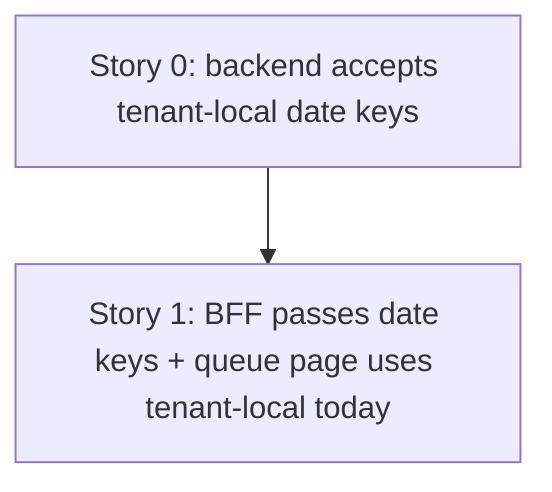

# TD48 — Booking List Date Filters Use UTC Days Instead of the Tenant's Timezone

## Status
- **Type**: Technical Debt / Correctness
- **Priority**: Medium — silently drops real bookings from the schedule and the bookings queue for any tenant taking bookings late on a week's (or day's) last local evening; needs no unusual volume. No tenant report yet.
- **Context**: `apps/backend` (booking context, `GET /bookings`), `apps/bff` (booking feature), `apps/web` (`app/dashboard/bookings`)
- **Created**: 2026-09-28
- **Discovered**: while verifying TD46 (PR #528) — first noted in TD47, then proven with a throwaway integration test the same day
- **Decision status**: Two stories in dependency order (Story 0 → Story 1); the approach below was decided in this session, `/story-discovery` has not run for either story
- **Related**: TD46 (`docs/archive/td/TD46-COLUMNS-BOARD-WEEK-BOUNDARY-BOOKING-FETCH-GAP.md`, PR #528) — its one-day-earlier fetch stays correct, but its scenario is narrower for UTC-3 tenants because of this bug; TD47 (`td/TD47-SCHEDULE-BOOKINGS-RANGE-FETCH-PAGINATION.md`) — independent row-cap defect on the same fetch; PR #417 (M20-S02) — the earlier fix of this same bug class on the availability path

---

## Problem

`GET /bookings` filters on `scheduledAt` (a UTC instant) using a `from`/`to`/`date` that every caller means as a **tenant-local calendar range**, but the range is converted as if it were UTC:

- `buildBookingListParams` (`apps/bff/src/features/booking/bookings-list-query.util.ts:17-24`) turns a date key into `${d}T00:00:00.000Z` … `${d}T23:59:59.999Z`, and `date` into the same pair.
- The backend applies them verbatim: `new Date(input.from)` / `new Date(input.to)` (`list-bookings.use-case.ts:61-62`), then `where.scheduledAt = Between(…)` (`typeorm-booking.repository.ts:159-164`). No timezone conversion happens anywhere on the path.

For a tenant behind UTC (`America/Sao_Paulo`, UTC-3 year-round) a booking after 21:00 local has a UTC instant on the **next** UTC day, so it falls outside its own local day's range; a tenant ahead of UTC loses the early-morning bookings of the first local day instead.

**Proven 2026-09-28** with a throwaway backend integration test against the repo's real `findAllByTenantPaginated` and the exact BFF bounds (tenant timezone `America/Sao_Paulo`; week Mon 2026-08-10 – Sun 2026-08-16):
- Booking A, Sunday 12:00 local (`2026-08-16T15:00:00.000Z`) — returned for that week (control).
- Booking B, Sunday 22:00 local (`2026-08-17T01:00:00.000Z`) — **not** returned for that week; returned for the next week's range (`2026-08-17`–`2026-08-23`).

Effect on the schedule: B does not appear in the Day view, Week view, or columns board of its own local week (it only surfaces as a columns-board spillover banner).

### Second, coupled defect — the bookings queue's own "today"
`apps/web/app/dashboard/bookings/page.tsx` builds `today`, `tomorrow` and `windowEnd` with `toISODate(now)` / `addDays(now, …)`, which is `date.toISOString().slice(0, 10)` — a plain **UTC** date, not the tenant's local date (the schedule page uses `toISODateInTimezone(new Date(), timezone)` correctly). Combined with the UTC bounds above, the queue's `date: today` list is internally consistent but shifted against the tenant's real day. **Fixing only the range conversion would make this page worse**, so both must change together. This part is from code reading only; it was not reproduced.

### The codebase already solves this elsewhere
- `localDateRangeBoundsUTC(from, to, timezone)` (`apps/backend/src/shared/utils/calendar-date.ts:120-133`) — its own doc comment describes this exact bug class and cites PR #417; used by the availability day-grid path.
- `admin-schedule-reminder.job.ts:38-46` and `booking-reminder.job.ts:112-135` compute tenant-local `startOf('day')`/`endOf('day')` with Luxon and pass them to the same `scheduledAfter`/`scheduledBefore` filter — so those already behave correctly. The list path is the outlier.
- The sibling endpoints (`GET /schedule/closures`, `/schedule/openings`, availability summary) already take `from=YYYY-MM-DD&to=YYYY-MM-DD` date keys and convert in the backend (`docs/14-API_CONTRACTS.md`).

### Premise notes (verified against the code, 2026-09-28)
- The BFF has **no** access to the tenant's timezone (no reference in `apps/bff/src`), so converting there would need a new tenant-settings read on every list request. The backend already injects `TENANT_SETTINGS_PORT` elsewhere in this context (`typeorm-booking.repository.ts:59`).
- The backend list DTO takes `from`/`to` as `z.iso.datetime()` instants (`list-bookings.dto.ts`); the BFF list controller is its only caller, and `buildBookingListParams` has a single caller.
- The shared repository filter is **inclusive** at both ends and has three callers (list use case + the two reminder jobs). `localDateRangeBoundsUTC` returns an **exclusive** end (next local midnight), so it is not a drop-in for this path.

---

## Chosen approach (decided in this session, 2026-09-28 — `/story-discovery` has not run)

Convert in the **backend**, where the tenant's timezone is already available, and pass **date keys** from the BFF, matching the sibling endpoints. Compute the inclusive local-day bounds the way the reminder jobs already do (`startOf('day')` / `endOf('day')` in the tenant zone), so the shared repository filter's inclusive semantics stay untouched.

Rejected: converting in the BFF (needs a new settings read per request, with nothing to gain); switching to `localDateRangeBoundsUTC`'s exclusive end (would force a semantic change in a filter three callers rely on).

**Why two stories, in this order:** the BFF and backend deploy as separate services, so a rolling deploy runs old and new side by side. Story 0 makes the backend accept date keys **in addition to** the existing instants, so an old BFF keeps working; only then does Story 1 switch the BFF and web over.

---

### Story 0 — Backend list-bookings accepts tenant-local date keys

**Agent:** backend-ts
**Complexity:** M
**Docs to load:** `docs/ENGINEERING_RULES_BACKEND.md`, `docs/14-API_CONTRACTS.md` (`GET /bookings` query params), `docs/08-TESTING_STRATEGY.md`, `docs/06-TENANT_ISOLATION_STRATEGY.md`
**Dependencies:** none
**Pattern:** plain composition — reuse the tenant-local day-bounds computation the reminder jobs already use; no new named pattern

**Discovered:** 2026-09-28, while verifying TD46 (PR #528); reproduced with a throwaway integration test the same day
**Root cause:** traced live — the BFF's UTC-day bounds (`bookings-list-query.util.ts:17-24`) applied verbatim by `list-bookings.use-case.ts:61-62` and `typeorm-booking.repository.ts:159-164`, with no timezone conversion.

**Description:**
Make `GET /bookings` interpret a date-key `from`/`to` in the tenant's timezone.

1. Extend `ListBookingsSchema` (`list-bookings.dto.ts`) so `from` and `to` each accept either a `YYYY-MM-DD` date key (`z.iso.date()`, calendar-validated per TD42) **or** the existing `z.iso.datetime()` instant. Instants keep today's exact behavior, so an old BFF keeps working during a rolling deploy.
2. Inject `TENANT_SETTINGS_PORT` into `ListBookingsUseCase` and read the tenant's timezone (`businessHours.timezone`, the same source `availability-summary.helpers.ts` uses). Read it only when a date key is present.
3. A date-key `from` becomes the start of that local day, and a date-key `to` becomes the **end** of that local day (inclusive), both as UTC instants — computed like the reminder jobs (`DateTime.fromISO(key, { zone }).startOf('day'|…endOf('day')).toUTC().toJSDate()`). Add a small helper next to `localDateRangeBoundsUTC` in `calendar-date.ts` for the inclusive form, rather than a fourth inline copy.
4. The repository filter and its other two callers (the reminder jobs) are **not** changed.
5. Update `docs/14-API_CONTRACTS.md`'s `GET /bookings` entry to state that `from`/`to` accept date keys (tenant-local) or instants, and add the matching request blocks to `apps/backend/http/booking/bookings.http`.

Open for `/story-discovery` (small): where exactly the helper lives and whether the reminder jobs adopt it in this story (recommended: no, leave them untouched — scope).

**Backend HTTP surface:** reuses `GET /bookings` — the query schema is extended, no new route.
**New migration / i18n keys / env vars / feature flags:** none

**Files to create/modify:**
- `apps/backend/src/contexts/booking/application/dtos/list-bookings.dto.ts` (modify) + `list-bookings.dto.spec.ts` (create)
- `apps/backend/src/contexts/booking/application/use-cases/list-bookings.use-case.ts` (modify) + `list-bookings.use-case.spec.ts` (modify)
- `apps/backend/src/shared/utils/calendar-date.ts` (modify — inclusive tenant-local day-bounds helper) + `calendar-date.spec.ts` (modify)
- `apps/backend/src/contexts/booking/application/use-cases/list-bookings.use-case.integration.spec.ts` (create — placement to confirm against the neighbouring `*.integration.spec.ts` convention)
- `apps/backend/http/booking/bookings.http` (modify)
- `docs/14-API_CONTRACTS.md` (modify)

**Acceptance criteria — product:**
- [ ] A booking at any local time on a day (including after 21:00 for a UTC-3 tenant) is returned when listing that local day or a local range containing it, and not returned for the adjacent day.

**Acceptance criteria — technical:**
- Unit:
  - [ ] `list-bookings.dto.spec.ts`: `from`/`to` accept a valid date key and a valid instant; reject `2026-02-30` and free text
  - [ ] `list-bookings.use-case.spec.ts`: a date-key range for a `America/Sao_Paulo` tenant reaches the repository as the local start of `from` and the local end of `to`, both as UTC instants; an instant input is passed through unchanged; the settings port is not read when only instants are given
  - [ ] `calendar-date.spec.ts`: the inclusive helper returns the local day's last millisecond, across a month boundary and for a UTC+ zone
- Integration:
  - [ ] Real Postgres: tenant `America/Sao_Paulo`, bookings at `2026-08-16T15:00:00.000Z` (Sunday 12:00 local) and `2026-08-17T01:00:00.000Z` (Sunday 22:00 local) — listing `from=2026-08-10&to=2026-08-16` returns **both**, and `from=2026-08-17&to=2026-08-23` returns neither
  - [ ] The same request with instants (`…T00:00:00.000Z`/`…T23:59:59.999Z`) behaves exactly as before (non-regression for an old BFF)
- Tenant isolation:
  - [ ] Tenant A's booking inside the range is not returned to a Tenant B caller, and the timezone used is Tenant B's own
- E2E: none — covered by the integration test; the surface is a query filter
- [ ] Coverage ≥80% on changed code
- [ ] `tsc --noEmit` clean, lint clean

---

### Story 1 — BFF passes date keys and the bookings queue uses the tenant's local "today"

**Agent:** bff-ts + frontend-ts (one deliberate two-layer PR — see the note below)
**Complexity:** M
**Docs to load:** `docs/24-BFF_ARCHITECTURE.md`, `docs/ENGINEERING_RULES_FRONTEND.md`, `docs/08-TESTING_STRATEGY.md`, `docs/14-API_CONTRACTS.md`
**Dependencies:** Story 0 — must be merged **and deployed** first, or this BFF would send date keys to a backend that still rejects them
**Pattern:** plain composition — no new named pattern

**Description:**
Stop converting date keys to UTC instants in the BFF, and make the bookings queue derive its dates in the tenant's timezone.

1. `buildBookingListParams` (`bookings-list-query.util.ts`) forwards `date` as `from = to = date` and `from`/`to` unchanged, as date keys, with no `T…Z` suffix. It still maps `page` to `offset`.
2. `apps/web/app/dashboard/bookings/page.tsx` derives `today` with `toISODateInTimezone(new Date(), timezone)` — the page already loads tenant settings (`fetchTenantSettings`), so no new fetch — and derives `tomorrow` and `windowEnd` by date-key arithmetic (`parseDateKey`/`addDays` from the schedule `date-utils`) instead of `addDays(now, …)` + `toISODate`.
3. Audit `BookingQueuePage.tsx`'s own client-side date arithmetic (`new Date(today + 'T00:00:00')`, `toISODate(windowStart)`) for the same UTC/local mixing, and fix what the tenant-local `today` exposes. Scope this to the queue page only.
4. Update the `.http` request blocks and the BFF list-query util's own spec accordingly (the util currently has none — add one).

**Why one PR for both layers:** shipping the BFF change alone would give the queue a UTC-date `today` interpreted as a local day (wrong for the evening window); shipping the web change alone would give it a local `today` still converted as UTC. Either order leaves a wrong window between the two merges, so they land together.

**BFF endpoint spec:** `GET /v1/bookings` — same route, auth and response shape; only the outgoing backend query changes (date keys instead of instants).
**New migration / i18n keys / env vars / feature flags:** none

**Files to create/modify:**
- `apps/bff/src/features/booking/bookings-list-query.util.ts` (modify) + `bookings-list-query.util.spec.ts` (create)
- `apps/bff/src/features/booking/bookings.controller.component.spec.ts` (modify — assert the outgoing `from`/`to` are date keys)
- `apps/web/app/dashboard/bookings/page.tsx` (modify — thin page)
- `apps/web/features/booking/components/dashboard/bookings/BookingQueuePage.tsx` (modify, if the audit finds mixing) + `BookingQueuePage.spec.tsx` (modify)
- `apps/bff/http/bookings/*.http` (modify — the folder is `apps/bff/http/bookings/`)

**Acceptance criteria — product:**
- [ ] For a UTC-3 tenant at 22:00 local, the bookings queue's "today" is still the current local day and lists the evening's approved bookings; nothing from the previous local evening appears in it.
- [ ] The schedule's Sunday-late-evening booking appears in its own local week (verified end to end once Story 0 is deployed).

**Acceptance criteria — technical:**
- Unit:
  - [ ] `bookings-list-query.util.spec.ts`: `date` → `from = to = date`; `from`/`to` pass through unsuffixed; `page`/`limit` → `offset`/`limit`; no `T…Z` suffix on any output
  - [ ] `BookingQueuePage.spec.tsx`: `today`/`tomorrow`/window boundaries derive from the passed tenant-local `today`, including across a month boundary
- Integration: n/a for web; BFF covered by the component test below
- Tenant isolation: n/a — no tenant data handled client-side; the BFF forwards the tenant context unchanged
- E2E:
  - [ ] none — a late-evening booking needs a controlled clock and timezone; covered by the unit and component tests
- BFF component:
  - [ ] `bookings.controller.component.spec.ts`: `GET /v1/bookings?date=2026-08-16` calls the backend with `from=2026-08-16&to=2026-08-16`
- [ ] Coverage ≥80% on changed code
- [ ] `tsc --noEmit` clean, lint clean

---

## Self-dry-run findings
- **4o (no workaround):** the root cause (a wrong-timezone range conversion) is fixed at the layer that owns the tenant's timezone, reusing the pattern the reminder jobs already use — no compensating offset, no BFF-side special case.
- **4q (pattern and test plan):** pattern stated per story; every tier has a named scenario, and the integration case is the proven reproduction (seed values included).
- **Expand/contract:** Story 0 accepts both forms, so no rolling-deploy window breaks. A later story could drop the instant form once nothing sends it; left out deliberately — nothing depends on removing it.
- **Ripple:** the two reminder jobs already behave correctly and are untouched. Other `listBookings` callers (`useBookings`, `BookingPhotoPicker`) send neither `date` nor `from`/`to`, so they are unaffected.
- **Open for `/story-discovery`:** the inclusive-helper's exact home and name (Story 0), and how far the queue-page audit reaches (Story 1).
